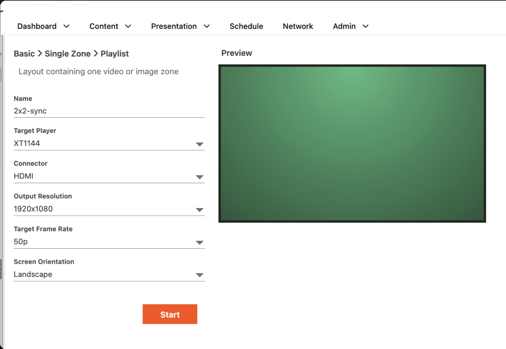
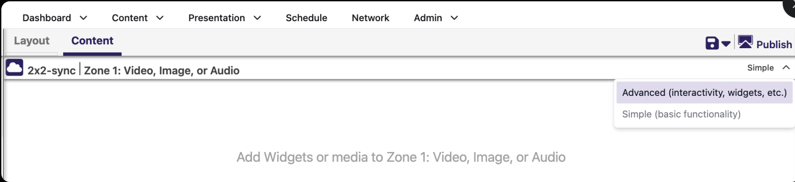
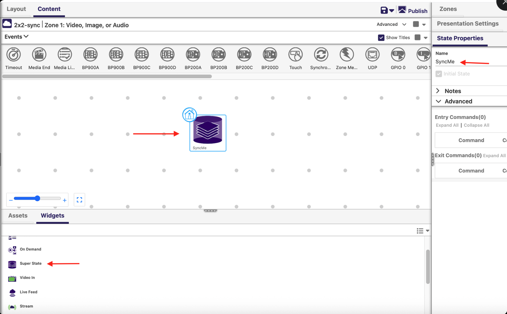
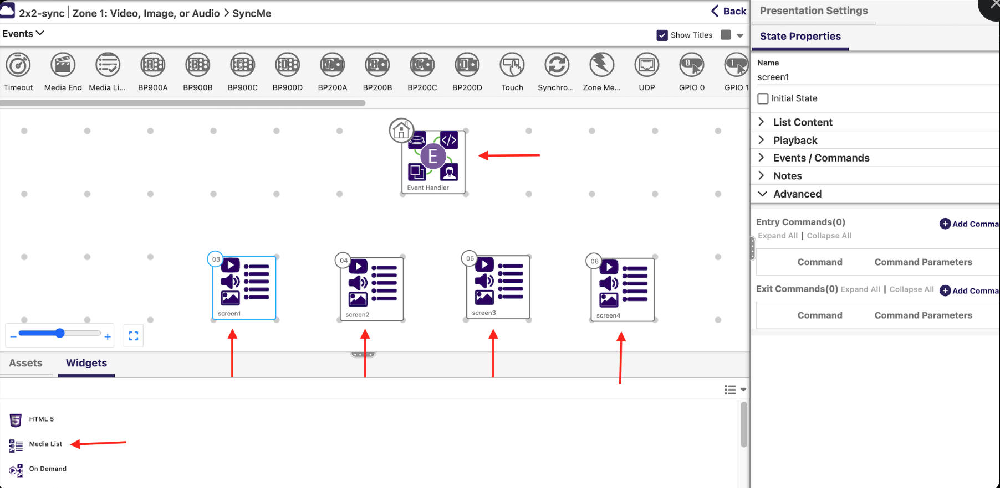
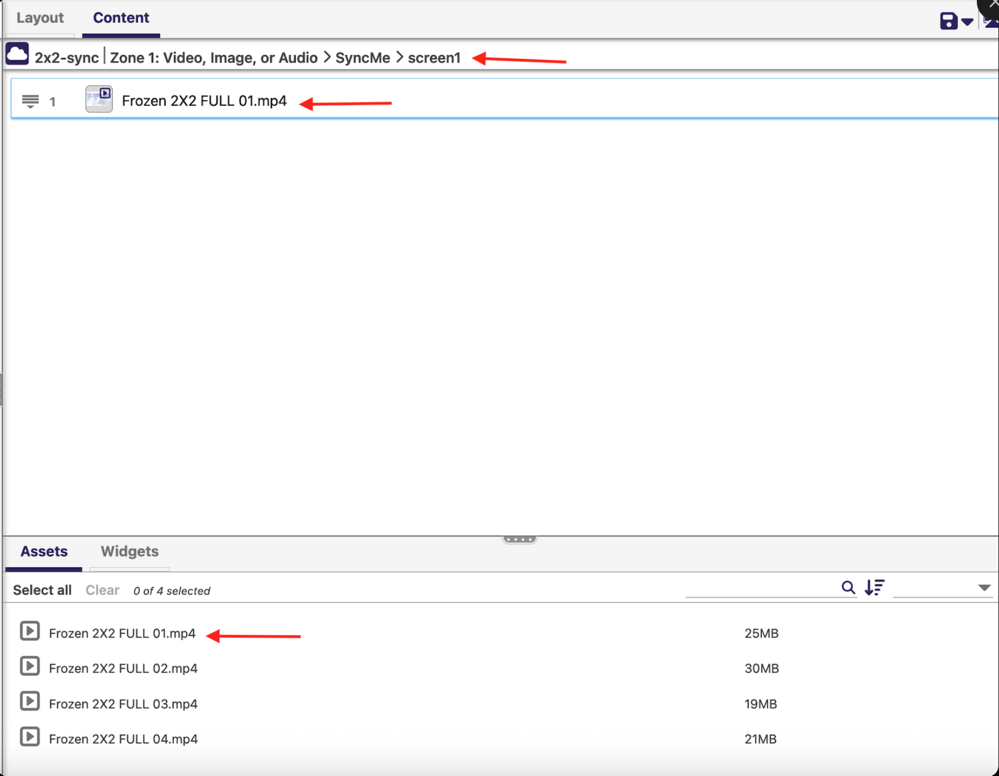
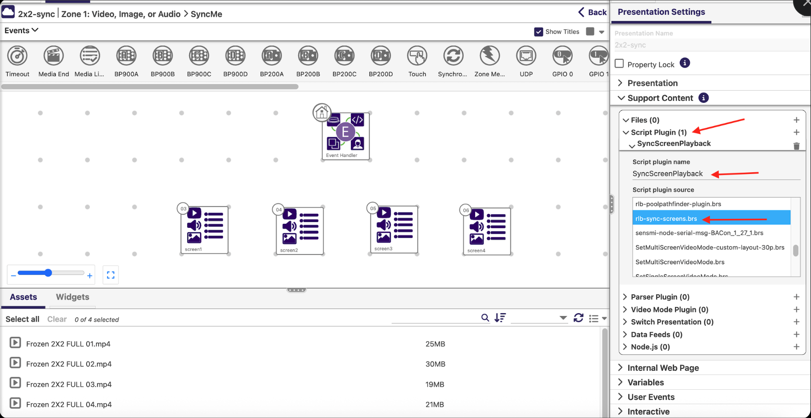
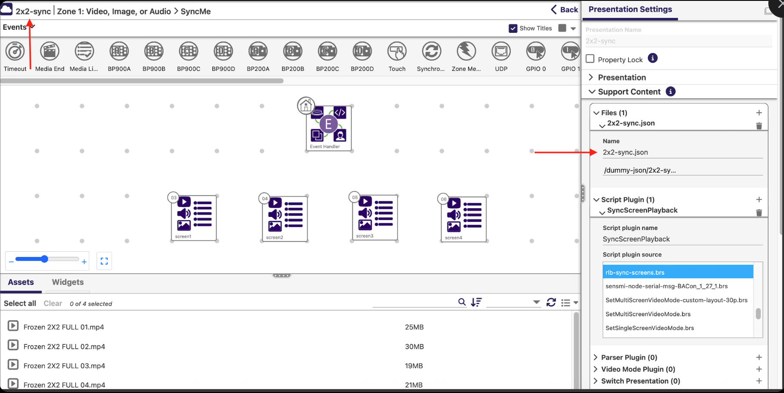
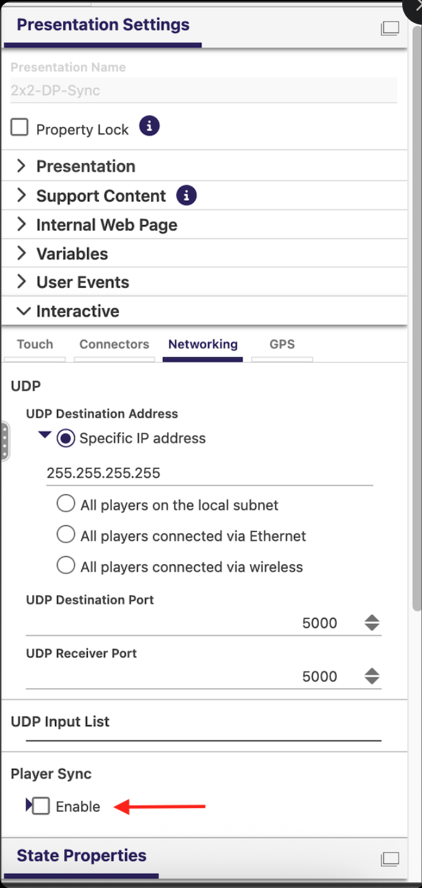

# simplerSync

`rlb-sync-screens.brs` is a BrightSign zone plugin (`SyncScreenPlayback`) that drives
synchronized multiscreen video-wall playback across BrightSign players, using
`roSyncManager` + PTP for frame-accurate sync and a `sync-config.json` file to assign
each physical player to a wall/screen position instead of hardcoding per-device settings
into the presentation.

The `sync-config.json` file itself is generated using the
[bs-videowall-config-builder](https://romeolb.github.io/bs-videowall-config-builder/) tool.

## Prerequisites

- **Player Sync must be disabled** (Presentation Settings > Interactive > Networking >
  Player Sync > leave **Enable** unchecked) — this plugin replaces BAC:on's built-in sync
  mechanism entirely, automatically managing leader/follower roles and sync messages
  itself based on `sync-config.json`.
- All players in a wall must be networked with PTP reachable between them (same
  `ptp_domain`, matching `ptp_interface`).
  - **Wi-Fi is not supported as the PTP interface** — the plugin intentionally skips
    writing `ptp_interface` to the registry when it's Wi-Fi, due to a known BrightSign
    OS bug (OS-20946) where Wi-Fi sync doesn't work correctly. Use a wired interface.
- A `sync-config.json` asset must be included in the presentation's asset pool, named to
  match the presentation itself: `<presentationName>.json`. At startup the plugin copies
  this file to `sync-config.json` on the player's default drive and reads it from there.

## Setting up a synchronized presentation (step by step)

Example walkthrough for a 2x2 video wall. `Template-BACon-4-screens-sync.bpfx` is a
starting-point template you can import into BrightAuthor:connected (`Presentation` >
`Import`) instead of building steps 1-2 from scratch — it already has the single
video/image zone and the `SyncMe` Super State with its four `screen1`-`screen4` states
wired up. You'll still need to attach the `SyncScreenPlayback` plugin and add your
presentation's `sync-config.json` yourself, as described below.

### 1. Create the presentation in BrightAuthor:connected



`Presentation` menu > choose the **Basic > Single Zone > Playlist** template
(a layout with one video or image zone). Fill in:

| Field | Example value |
|---|---|
| Name | `2x2-sync` |
| Target Player | `XT1144` |
| Connector | `HDMI` |
| Output Resolution | `1920x1080` |
| Target Frame Rate | `50p` |
| Screen Orientation | `Landscape` |

Click **Start** to create the presentation.

### 2. Switch the presentation to Advanced mode



In the presentation's **Content** tab, use the **Simple / Advanced** dropdown (top
right) and select **Advanced (interactivity, widgets, etc.)**. Advanced mode is required
to attach a zone plugin and add non-media assets like `sync-config.json` to the asset
pool.

### 3. Add a Super State to the interactive playlist



In the zone's **Widgets** panel, drag the **Super State** widget onto the interactive
playlist canvas. In **State Properties** on the right, set its **Name** to `SyncMe`.

### 4. Add an Event Handler and one Media List per screen



Open the `SyncMe` super state. From **Widgets**, add an **Event Handler** widget and set
it as the initial state (the home icon). Then add one **Media List** widget per screen in
the wall, naming each state to match the `screens.<name>` keys used in
`sync-config.json` — for a 2x2 wall: `screen1`, `screen2`, `screen3`, `screen4`.

### 5. Add the video file(s) to each screen's Media List



Open each `screen<N>` Media List state and add the video asset(s) that should play on
that physical screen — e.g. the quadrant of the source video meant for the top-left
display goes in `screen1`, and so on for each screen in the wall.

### 6. Add `rlb-sync-screens.brs` as a Script Plugin



Open the presentation's **Presentation Settings** panel (top right) > **Support
Content** > **Script Plugin** > **+** to add one. Set:

| Field | Value |
|---|---|
| Script plugin name | `SyncScreenPlayback` |
| Script plugin source | `rlb-sync-screens.brs` |

The plugin name **must** be `SyncScreenPlayback` — this is how BrightAuthor:connected
associates the uploaded `.brs` source with the `SyncScreenPlayback` zone plugin the
script implements.

### 7. Add the `sync-config.json` asset, named to match the presentation



Generate the wall config JSON with
[bs-videowall-config-builder](https://romeolb.github.io/bs-videowall-config-builder/),
then add it to **Presentation Settings > Support Content > Files** (**+**). The file
**must be named to match the presentation**: for a presentation named `2x2-sync`, the
file must be named `2x2-sync.json`. At startup the plugin copies this file to
`sync-config.json` on the player's default drive — see the format below.

### 8. Make sure Player Sync is disabled



In **Presentation Settings > Interactive > Networking > Player Sync**, leave **Enable**
unchecked. The plugin and `sync-config.json` handle assigning master/leader and
slave/follower roles and sending/handling sync messages automatically — BAC:on's
built-in Player Sync must stay off, per the Prerequisites above.

### 9. Publish to all players in the wall

Publish the presentation to every player listed in the `sync-config.json` you generated
in step 7 (matched by serial number in the `screens` map). Once all players have synced
content and rebooted/restarted as needed, playback should lock together across the wall.

> **Note:** expect up to ~1 frame of drift/offset between players even when synced
> correctly. This is more noticeable on Series 5 players.

## `sync-config.json` format

The file is a **JSON array of wall configs** — one entry per physical video wall (i.e.
one entry per group of players that sync together), not one entry per player. On
startup, every player reads the *entire* array and searches every entry's `screens` map
for its own serial number to figure out which wall it belongs to. This is the format
produced by the [bs-videowall-config-builder](https://romeolb.github.io/bs-videowall-config-builder/)
tool (serials below are dummy placeholders):

```json
[
  {
    "config_file": "Example Wall.json",
    "Multiscreen_Mode_Enabled": false,
    "ptp_domain": "0",
    "ptp_interface": "eth0",
    "master_serial": "AAA000000001",
    "wall_name": "Lobby Wall",
    "wall": {
      "columns": 2,
      "rows": 2,
      "screen_width_mm": 0,
      "screen_height_mm": 0,
      "bezel_mode": "identical"
    },
    "screens": {
      "screen1": {
        "serial": "AAA000000001",
        "MultiscreenWidth": 0,
        "MultiscreenHeight": 0,
        "MultiscreenX": 0,
        "MultiscreenY": 0,
        "x_pct": 0,
        "y_pct": 0,
        "bezel_inputs": { "no_compensation": true }
      },
      "screen2": {
        "serial": "AAA000000002",
        "MultiscreenWidth": 0,
        "MultiscreenHeight": 0,
        "MultiscreenX": 0,
        "MultiscreenY": 0,
        "x_pct": 0,
        "y_pct": 0,
        "bezel_inputs": { "no_compensation": true }
      },
      "screen3": {
        "serial": "AAA000000003",
        "MultiscreenWidth": 0,
        "MultiscreenHeight": 0,
        "MultiscreenX": 0,
        "MultiscreenY": 0,
        "x_pct": 0,
        "y_pct": 0,
        "bezel_inputs": { "no_compensation": true }
      },
      "screen4": {
        "serial": "AAA000000004",
        "MultiscreenWidth": 0,
        "MultiscreenHeight": 0,
        "MultiscreenX": 0,
        "MultiscreenY": 0,
        "x_pct": 0,
        "y_pct": 0,
        "bezel_inputs": { "no_compensation": true }
      }
    }
  },
  {
    "config_file": "Example Wall.json",
    "Multiscreen_Mode_Enabled": false,
    "ptp_domain": "0",
    "ptp_interface": "eth0",
    "master_serial": "AAA000000005",
    "wall_name": "Break Room Wall",
    "wall": {
      "columns": 2,
      "rows": 2,
      "screen_width_mm": 0,
      "screen_height_mm": 0,
      "bezel_mode": "identical"
    },
    "screens": {
      "screen1": { "serial": "AAA000000005", "MultiscreenWidth": 0, "MultiscreenHeight": 0, "MultiscreenX": 0, "MultiscreenY": 0, "x_pct": 0, "y_pct": 0, "bezel_inputs": { "no_compensation": true } },
      "screen2": { "serial": "AAA000000006", "MultiscreenWidth": 0, "MultiscreenHeight": 0, "MultiscreenX": 0, "MultiscreenY": 0, "x_pct": 0, "y_pct": 0, "bezel_inputs": { "no_compensation": true } },
      "screen3": { "serial": "AAA000000007", "MultiscreenWidth": 0, "MultiscreenHeight": 0, "MultiscreenX": 0, "MultiscreenY": 0, "x_pct": 0, "y_pct": 0, "bezel_inputs": { "no_compensation": true } },
      "screen4": { "serial": "AAA000000008", "MultiscreenWidth": 0, "MultiscreenHeight": 0, "MultiscreenX": 0, "MultiscreenY": 0, "x_pct": 0, "y_pct": 0, "bezel_inputs": { "no_compensation": true } }
    }
  }
]
```

The array holding two entries above shows two independent walls (e.g. two rooms) sharing
one `sync-config.json` — every player at the site reads the same file and only acts on
the entry whose `screens` map contains its own serial.

Field notes:

| Field | Meaning |
|---|---|
| `master_serial` | Serial number of the sync **leader** for this wall. Any player whose own serial matches this becomes the leader (`roSyncManager.SetAsLeader(true)`); every other player in the same entry is a follower. |
| `ptp_domain` / `ptp_interface` | Written to the player's registry if different from what's currently stored; a mismatch triggers a reboot so the new PTP config takes effect. |
| `screens.<name>.serial` | Serial number of the player that should play the zone/state named `<name>`. This is how a player figures out which zone content it's responsible for (`m.bsp.sign.zoneshsm[0].statetable[<name>]`) — the zone/state name in the presentation must match this key. |
| `Multiscreen_Mode_Enabled` | When `true`, the player applies `MultiscreenWidth/Height/X/Y` and `x_pct`/`y_pct` bezel compensation from its `screens` entry to the video player. |
| `config_file` | Not used for role/logic decisions — just printed to the log (`Matched wall config: ...`) once a player finds its entry, for diagnostics. |
| `wall_name` | Purely descriptive metadata from the config-builder tool; the plugin doesn't read it. |

If a player's serial isn't found in any entry's `screens` map, it logs
`No matching wall config found in sync-config.json for serial ...` and does not get a
wall/screen/role assigned.

## Master/slave (leader/follower) behavior

- Role is decided purely by comparing the player's own serial number
  (`roDeviceInfo.GetDeviceUniqueId()`) against `master_serial` for its matched wall entry.
- The leader drives playback (`PlayfilesFromStorageMedia`); followers play in response to
  `roSyncManagerEvent`s from the leader.
- A sync watchdog reinitializes `roSyncManager` if no sync event arrives within ~90
  seconds (about 3x an expected clip duration), on both leader and followers. After 2
  failed reinit attempts it reboots the player instead.

## Live group/schedule changes (BSN.cloud)

The plugin subscribes to `roControlCloud` and listens for the same
`checkforcontent`/`updateSettings`/`updateSchedule` messages BrightSign's own supervisor
uses. If BSN.cloud pushes `updateSettings: true` or `updateSchedule: true` — e.g. after
moving the device to a different BSN.cloud group, or changing its schedule — the plugin
**reboots the player**. This is intentional: rebooting is the only way for the plugin to
force a full re-read of `sync-config.json` and a fresh sync-spec/schedule pull from
BSN.cloud, since a plain presentation restart (`bsp.Restart("")`) only reloads content
already synced locally and doesn't talk to BSN.cloud at all.

Anyone deploying this should expect: **any settings or schedule change pushed from
BSN.cloud causes an unannounced reboot**, not just a soft content refresh.

## Playlist / seamless looping behavior

The plugin rebuilds its playlist from either a populated media-library zone or a live
data feed on the matched screen's zone. When the rebuilt playlist has exactly one item,
the plugin checks that item's probe data (`AC=` audio-codec field) via
`IsAudioCompatibleForSeamlessLoop`: if the file has no audio track, or its audio codec is
on the (currently empty) `COMPATIBLE_AUDIO_CODECS` allow-list, it enables seamless looping
— `SetLoopMode(1)`, and the plugin does not restart the file itself on end-of-file, since
the player loops it internally. Otherwise (multiple items, or a single item with an
audio codec not known to loop cleanly) it disables seamless mode — `SetLoopMode(0)` — and
restarts the video player on every end-of-file so events fire correctly between items.
This recalculation happens every time the playlist is rebuilt, so it stays correct as the
feed grows or shrinks.

**Audio codec allow-list.** `COMPATIBLE_AUDIO_CODECS` is deliberately empty right now —
AAC is confirmed to loop erratically under `SetLoopMode(1)` and is intentionally excluded,
and no other codec has been tested and confirmed safe yet. Only silent/no-audio files get
seamless looping until a specific codec is verified on-device and added to the list.

**Sync watchdog interaction.** The sync watchdog normally reinitializes (and eventually
reboots) the player if no sync event arrives for `syncWatchdogTimeout` seconds, since that
normally indicates a failed `roSyncManager`. Seamless-looped single-item playback
intentionally produces no further sync events once it starts looping, so the watchdog
skips reinit/reboot and just rearms itself while `m.seamlessLooping = 1`.

## Diagnostics

- PTP state transitions and periodic polling (`roPtp`) are logged to the console and via
  `roSystemLog`.
- A one-time sync-timing trace (`SyncTimingLog: ...` lines) runs for the first 3 playback
  loops after boot, showing role, loop number, sync ID, sync-event-received time, and
  video-playing time — console output only, no file is written to storage.

## Known limitations

- Wi-Fi cannot be used as the PTP sync interface (see Prerequisites).
- Even with correct PTP sync, expect up to ~1 frame of drift/offset between players;
  more noticeable on Series 5 players.
- Any BSN.cloud settings/schedule push reboots the player rather than doing a lighter
  content-only refresh.
- `sync-config.json` must be regenerated/re-uploaded as part of the presentation asset
  pool any time wall membership, screen assignment, or PTP config changes — the plugin
  only reads it at startup (or after the reboot triggered by a settings/schedule push).

## Files in this repo

- `rlb-sync-screens.brs` — the plugin.
- `Template-BACon-4-screens-sync.bpfx` — a BrightAuthor:connected presentation template
  (import via `Presentation` > `Import`) with the zone and `SyncMe` Super State/screen1-4
  states already set up, matching the walkthrough above. The plugin and
  `sync-config.json` still need to be added per-presentation as described below.
- `sync-config.json` is **not** included here — it's presentation/deployment-specific
  (one file per set of video walls) and must be authored and added to each presentation's
  asset pool separately, named `<presentationName>.json`. See the format above.
